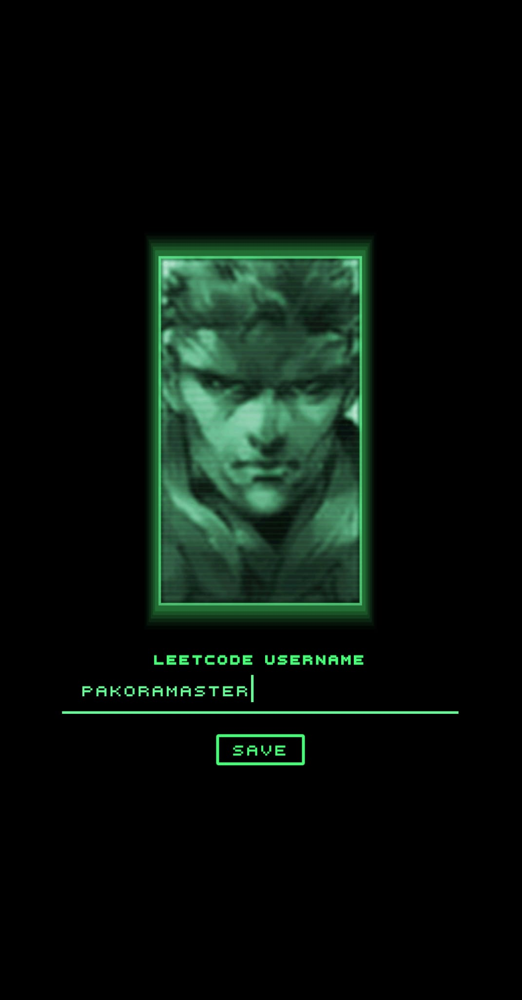

**Description**
- A compact Android application written in Kotlin using Jetpack Compose. It's a LeetCode reminder app with a UI heavily inspired by the "Codec" calls from Metal Gear Solid. Once a valid LeetCode username is provided, a Worker is scheduled to run periodically and send notifications if the user hasn't solved any LeetCode problems that day. The daily problem goal is currently hardcoded — future improvements include letting users set a custom daily LeetCode goal. 

**Interesting techniques**
- **Jetpack Compose UI**: declarative, state-driven UI with composable functions — see the official docs: https://developer.android.com/jetpack/compose
- **Compose BOM**: aligns Compose artifact versions via a Bill of Materials — https://developer.android.com/jetpack/compose#bom and see [gradle/libs.versions.toml](gradle/libs.versions.toml)
- **Efficient image loading & GIFs with Coil**: modern, coroutine-friendly image loader with GIF support via `coil-gif` — https://coil-kt.github.io/coil/
- **Media playback with Media3**: ExoPlayer successor with media UI components and integration points — https://developer.android.com/guide/topics/media/media3
- **Background work with WorkManager**: reliable, battery-friendly background jobs and constraints-aware scheduling — https://developer.android.com/topic/libraries/architecture/workmanager
- **Low-level HTTP control with OkHttp + Gson**: fast HTTP client and compact JSON (de)serialization — OkHttp: https://square.github.io/okhttp/ — Gson: https://github.com/google/gson


**Non-obvious / noteworthy technologies**
- Gradle Version Catalog (`gradle/libs.versions.toml`) for centralized dependency management.
- Compose BOM usage to avoid mismatched Compose artifact versions.
- `coil-gif` for explicit GIF decoding and rendering in Compose.
- `androidx.media3:media3-ui` for prebuilt playback UI components.
- `androidx.core:core-splashscreen` for modern splash screen behavior across OS versions.
- Kotlin 2.x with the Compose Kotlin plugin — up-to-date Kotlin toolchain and compiler plugin.

**Project structure**
```
/ (repo root)
app/
gradle/
.github/
build/
local.properties
settings.gradle.kts
gradlew
gradlew.bat
```
- `app/`: Android application module. Sources live under `app/src/main/` and module config is at [app/build.gradle.kts](app/build.gradle.kts).
- `gradle/`: Gradle metadata and the version catalog at [gradle/libs.versions.toml](gradle/libs.versions.toml).
- `.github/`: CI workflows; see [.github/workflows/build_apk.yml](.github/workflows/build_apk.yml).
- `build/`: build outputs (generated, ignored in VCS).
- `local.properties`, `gradlew`, and `settings.gradle.kts`: standard Android/Gradle tooling and workspace config.

**Versioned releases**
- Edit `APP_VERSION` in [gradle.properties](gradle.properties) before publishing a new release (for example, `1.0.0` to `1.1.0`).
- Every push to the repository's current default branch (`master`) runs unit tests, lint, and an APK build. The workflow also listens to `main` so it is ready if the default branch is renamed.
- GitHub Actions supplies `versionCode` from its monotonically increasing run number; local builds fall back to `APP_VERSION_CODE`.
- Every successful push points `v<APP_VERSION>` at the new commit and creates or updates that GitHub release. Repeated pushes with the same version replace its existing `Codec-<APP_VERSION>-Android.apk`; incrementing `APP_VERSION` starts a new release.
- Release APKs are signed with a persistent private key restored from GitHub Actions secrets. The workflow fails instead of publishing if any signing secret is missing, and verifies the completed APK with `apksigner` before uploading it.

**One-time Android signing setup**
1. Run `./scripts/setup-release-signing.ps1` from PowerShell and enter new keystore and key passwords when prompted. The script generates a 4096-bit RSA key, uploads the four required GitHub Actions secrets, and never commits the private key.
2. Securely back up `signing/codec-release.jks`, its `codec` alias, and both passwords somewhere outside the repository. The adjacent `.pem` file is only the public certificate.
3. Keep that backup permanently. Android only accepts an update when it is signed with the same key as the installed app. Existing debug-signed installations must be uninstalled once before installing the first release-signed APK.


